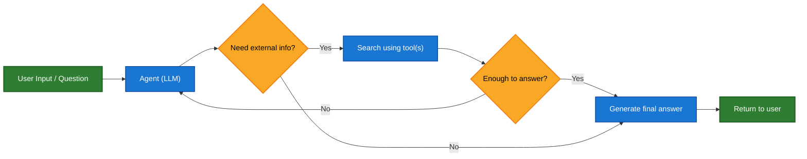

# Chat LangChain Study

基于 LangChain 构建的智能聊天代理系统，具备本地知识库检索和网络搜索能力。本项目展示了如何利用 LangGraph 和 Agent 技术构建一个能够自主决定何时使用工具的智能对话系统。


## 目录

- [功能特性](#功能特性)
- [项目架构](#项目架构)
- [技术栈](#技术栈)
- [环境变量](#环境变量)
- [安装与运行](#安装与运行)
- [使用方法](#使用方法)
- [实现逻辑](#实现逻辑)
- [优势特点](#优势特点)
- [许可证](#许可证)

## 功能特性

- 🤖 智能 Agent：基于 LangGraph 的自主决策 Agent，能够根据用户问题决定是否使用工具
- 💬 流式响应：支持服务端推送事件(SSE)的实时流式响应
- 📚 本地知识库：集成 Chroma 向量数据库，支持本地文档检索
- 🔍 网络搜索：集成 Tavily 搜索引擎，获取最新网络信息
- 🧠 记忆能力：支持对话历史记录和状态持久化
- 🎨 现代前端：响应式网页界面，支持深色/浅色主题切换
- 🌐 多语言：默认使用中文交互界面

## 项目架构

```
chat-langchain-study/
├── backend/                    # 后端服务
│   ├── config/                 # 配置文件
│   │   ├── schema/             # 数据模型定义
│   │   └── agent_state.py      # Agent 状态定义
│   ├── core/                   # 核心模块
│   │   ├── agents/             # Agent 实现
│   │   ├── prompts/            # 提示词模板
│   │   └── tools/              # 工具实现
│   ├── rag/                    # 向量检索模块
│   └── main.py                 # 应用入口
└── frontend/                   # 前端界面
    ├── index.html              # 主页面
    ├── script.js               # 交互逻辑
    └── style.css               # 样式文件
```

## 技术栈

### 后端技术

- [FastAPI](https://fastapi.tiangolo.com/) - 高性能 Python Web 框架
- [LangChain](https://www.langchain.com/) - LLM 应用开发框架
- [LangGraph](https://langchain-ai.github.io/langgraph/) - 构建语言代理工作流
- [Chroma](https://www.trychroma.com/) - 向量数据库
- [Ollama](https://ollama.ai/) - 本地嵌入模型服务
- [DeepSeek](https://www.deepseek.com/) - 大语言模型提供商

### 前端技术

- HTML/CSS/JavaScript - 基础前端技术
- [Marked.js](https://marked.js.org/) - Markdown 解析器
- [Highlight.js](https://highlightjs.org/) - 代码高亮库
- [Font Awesome](https://fontawesome.com/) - 图标库

## 环境变量

在运行项目之前，需要配置以下环境变量。请参考 `backend/.env.example` 文件：

```bash
# API 密钥
DEEPSEEK_API_KEY=your-deepseek-api-key-here
TAVILY_API_KEY=your-tavily-api-key-here
GLM_API_KEY=your-glm-api-key-here

# LangSmith 配置（可选）
LANGCHAIN_PROJECT=
LANGCHAIN_TRACING_V2=true
LANGCHAIN_ENDPOINT=https://api.smith.langchain.com
LANGSMITH_API_KEY=your-langsmith-api-key-here

# Chroma 数据库配置
CHROMADB_PRESIST=./chroma_db
DOCS_INDEX_NAME=LangChain_Combined_Docs
```

## 安装与运行

### 后端服务

1. 安装依赖：
```bash
cd backend
pip install -r requirements.txt
```

2. 配置环境变量：
```bash
cp .env.example .env
# 编辑 .env 文件填入实际的 API 密钥
```

3. 运行服务：
```bash
python main.py
```

### 前端界面

前端为静态文件，可以直接用浏览器打开 `frontend/index.html`，或者使用简单的 HTTP 服务器：

```bash
cd frontend
python -m http.server 3000
```

访问 http://localhost:3000 查看应用。

## 使用方法

1. 打开前端界面
2. 输入问题，例如：
   - "LangChain 是什么？"
   - "最新的 AI 新闻有哪些？"
3. 系统会根据问题自动决定使用本地知识库还是网络搜索
4. 查看带有引用标注的回答结果

## 实现逻辑



系统核心流程：

1. 用户通过前端界面提交问题
2. 后端接收请求并传递给 Agent
3. Agent 分析问题并决定是否需要调用工具：
   - 对于涉及特定领域知识的问题，调用 [retrieve_docs](file:///D:/MiCloud/happy-langchain/Item/chat-langchain-study-main/backend/core/tools/tools.py#L7-L33) 检索本地知识库
   - 对于需要最新信息的问题，调用 [web_search](file:///D:/MiCloud/happy-langchain/Item/chat-langchain-study-main/backend/core/tools/tools.py#L35-L50) 进行网络搜索
4. Agent 整合工具返回的结果和自身知识生成回答
5. 通过 SSE 流式传输回答内容到前端
6. 前端实时渲染 Markdown 格式的回答

## 优势特点

### 1. 智能工具选择
Agent 能够自主判断何时使用工具以及使用哪个工具，无需用户手动指定。

### 2. 可靠的知识溯源
所有引用都有明确的来源标注，用户可以追溯信息出处。

### 3. 灵活的架构设计
采用模块化设计，易于扩展新的工具和功能。

### 4. 流畅的用户体验
- 实时流式响应，用户无需等待完整回答
- 支持 Markdown 和代码高亮
- 响应式设计，适配不同设备
- 对话历史本地存储

### 5. 多样化的检索能力
同时支持本地知识库和网络搜索，满足不同类型问题的需求。

